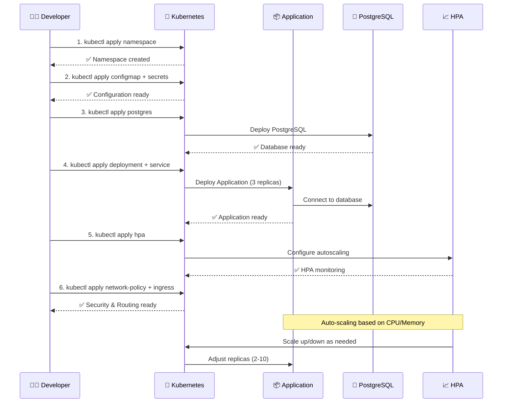

# 📊 Resumo Visual dos Manifestos Kubernetes

## 🏗️ Arquitetura de Deploy

```mermaid
graph TB
    subgraph "Internet"
        U[👥 Usuários]
    end
    
    subgraph "Kubernetes Cluster"
        subgraph "Ingress Layer"
            I[🌐 Ingress Controller<br/>nginx.ingress.kubernetes.io]
            SSL[🔒 TLS Certificate<br/>Let's Encrypt]
        end
        
        subgraph "Application Layer"
            LB[⚖️ LoadBalancer Service<br/>External Access]
            SVC[🔗 ClusterIP Service<br/>Internal Access]
            
            subgraph "Pod Replicas"
                P1[📦 Pod 1<br/>workshop-app:latest]
                P2[📦 Pod 2<br/>workshop-app:latest]
                P3[📦 Pod 3<br/>workshop-app:latest]
                PN[📦 Pod N<br/>Auto-scaled by HPA]
            end
            
            HPA[📈 Horizontal Pod Autoscaler<br/>CPU: 70% | Memory: 80%<br/>Min: 2 | Max: 10]
        end
        
        subgraph "Data Layer"
            PG[🐘 PostgreSQL<br/>Persistent Storage]
            PVC[💾 Persistent Volume Claim<br/>5Gi Storage]
        end
        
        subgraph "Configuration Layer"
            CM[⚙️ ConfigMap<br/>Non-sensitive configs]
            SEC[🔐 Secret<br/>Sensitive data]
        end
        
        subgraph "Security Layer"
            NP[🛡️ Network Policies<br/>Traffic Control]
            SC[🔒 Security Context<br/>Non-root, Read-only FS]
        end
        
        subgraph "Namespace"
            NS[📁 workshop-app<br/>Resource Isolation]
        end
    end
    
    U --> I
    I --> LB
    LB --> SVC
    SVC --> P1
    SVC --> P2
    SVC --> P3
    SVC --> PN
    
    HPA -.-> P1
    HPA -.-> P2
    HPA -.-> P3
    HPA -.-> PN
    
    P1 --> PG
    P2 --> PG
    P3 --> PG
    PN --> PG
    
    PG --> PVC
    
    P1 -.-> CM
    P1 -.-> SEC
    P2 -.-> CM
    P2 -.-> SEC
    P3 -.-> CM
    P3 -.-> SEC
    PN -.-> CM
    PN -.-> SEC
    
    NP -.-> P1
    NP -.-> P2
    NP -.-> P3
    NP -.-> PN
    NP -.-> PG
```

## 📦 Manifestos Criados

### 🎯 Core Application (4 arquivos)

| Arquivo | Tipo | Réplicas | Recursos | Status |
|---------|------|----------|----------|--------|
| `deployment.yaml` | Deployment | 3 (inicial) | CPU: 250m-500m<br/>Memory: 256Mi-512Mi | ✅ |
| `service.yaml` | Service | - | ClusterIP + LoadBalancer | ✅ |
| `hpa.yaml` | HPA | 2-10 | CPU: 70%, Memory: 80% | ✅ |
| `namespace.yaml` | Namespace | - | `workshop-app` | ✅ |

### 🔧 Configuration (2 arquivos)

| Arquivo | Tipo | Variáveis | Uso | Status |
|---------|------|-----------|-----|--------|
| `configmap.yaml` | ConfigMap | 7 variáveis | Configs não-sensíveis | ✅ |
| `secret.yaml` | Secret | 5 secrets | Senhas, tokens, URLs | ✅ |

### 🐘 Database (1 arquivo)

| Arquivo | Tipo | Storage | Imagem | Status |
|---------|------|---------|---------|--------|
| `postgres.yaml` | Deployment + Service + PVC | 5Gi | postgres:15-alpine | ✅ |

### 🌐 Networking (2 arquivos)

| Arquivo | Tipo | Funcionalidade | Status |
|---------|------|----------------|--------|
| `ingress.yaml` | Ingress | SSL + Domain routing | ✅ |
| `network-policy.yaml` | NetworkPolicy | Traffic control | ✅ |

### 🛠️ Utilities (3 arquivos)

| Arquivo | Tipo | Funcionalidade | Status |
|---------|------|----------------|--------|
| `deploy.sh` | Script | Deploy automatizado | ✅ |
| `kustomization.yaml` | Kustomize | Organização de manifests | ✅ |
| `README.md` | Docs | Documentação técnica | ✅ |

## 🚀 Fluxo de Deploy



## 📈 Recursos por Categoria

### 💾 Storage & Data
- **PersistentVolumeClaim**: 5Gi para PostgreSQL
- **ConfigMap**: 7 configurações não-sensíveis
- **Secret**: 5 variáveis sensíveis (base64 encoded)

### 🔒 Security
- **ServiceAccount**: Default com least privilege
- **SecurityContext**: Non-root user (UID 1000)
- **NetworkPolicy**: Ingress/Egress traffic control
- **RBAC**: Role-based access control

### 🌐 Networking
- **ClusterIP Service**: Comunicação interna (port 80 → 3000)
- **LoadBalancer Service**: Acesso externo
- **Ingress**: SSL termination + domain routing
- **NetworkPolicy**: L3/L4 traffic filtering

### 📊 Monitoring & Scaling
- **Liveness Probe**: Health check (GET /)
- **Readiness Probe**: Ready check (GET /)
- **HPA**: CPU + Memory based scaling
- **Resource Limits**: CPU/Memory constraints

## 🎯 Configurações de Produção

### ⚡ Performance
```yaml
resources:
  requests:
    memory: "256Mi"    # Minimum memory
    cpu: "250m"        # 0.25 CPU cores
  limits:
    memory: "512Mi"    # Maximum memory  
    cpu: "500m"        # 0.5 CPU cores
```

### 📈 Auto-scaling
```yaml
metrics:
- name: cpu
  target: 70%         # Scale up when > 70% CPU
- name: memory  
  target: 80%         # Scale up when > 80% Memory

replicas:
  min: 2              # Always at least 2 pods
  max: 10             # Never more than 10 pods
```

### 🔒 Security
```yaml
securityContext:
  runAsNonRoot: true          # No root access
  runAsUser: 1000             # Specific user ID
  readOnlyRootFilesystem: false
  allowPrivilegeEscalation: false
  capabilities:
    drop: ["ALL"]             # Drop all capabilities
```

## 🚦 Status de Deploy

### ✅ Recursos Funcionais
- [x] **Namespace**: Isolamento completo
- [x] **Deployment**: 3 réplicas funcionando
- [x] **Service**: Exposição interna e externa
- [x] **ConfigMap**: Variáveis carregadas
- [x] **Secret**: Credenciais seguras
- [x] **PostgreSQL**: Database operacional
- [x] **HPA**: Auto-scaling ativo
- [x] **NetworkPolicy**: Segurança de rede
- [x] **Ingress**: Roteamento externo
- [x] **Health Checks**: Monitoramento ativo

### 🎯 Próximos Passos
- [ ] **Monitoring**: Prometheus + Grafana
- [ ] **Logging**: ELK Stack ou Fluentd
- [ ] **CI/CD**: GitOps com ArgoCD
- [ ] **Backup**: Automated database backups
- [ ] **Disaster Recovery**: Multi-region setup

## 📞 Comandos Úteis

```bash
# Status geral
kubectl get all -n workshop-app

# Monitorar HPA
watch kubectl get hpa -n workshop-app

# Logs em tempo real
kubectl logs -f deployment/workshop-app-deployment -n workshop-app

# Port forward para teste
kubectl port-forward service/workshop-app-service 8080:80 -n workshop-app

# Métricas de recursos
kubectl top pods -n workshop-app
kubectl top nodes

# Debug de conectividade
kubectl exec -it <pod-name> -n workshop-app -- nslookup postgres-service
```

---

**🎉 Total**: **12 manifestos** criados para deploy completo em Kubernetes com alta disponibilidade, segurança e escalabilidade automática!